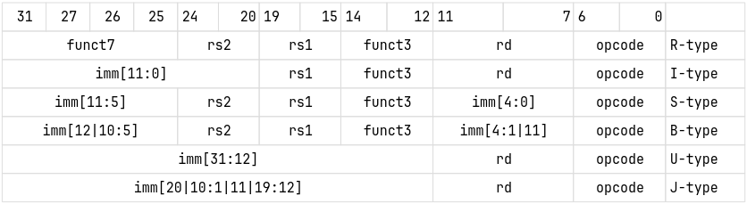
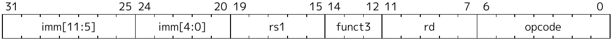
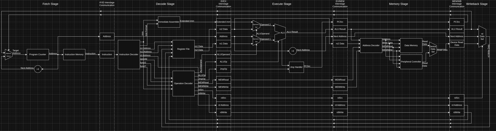
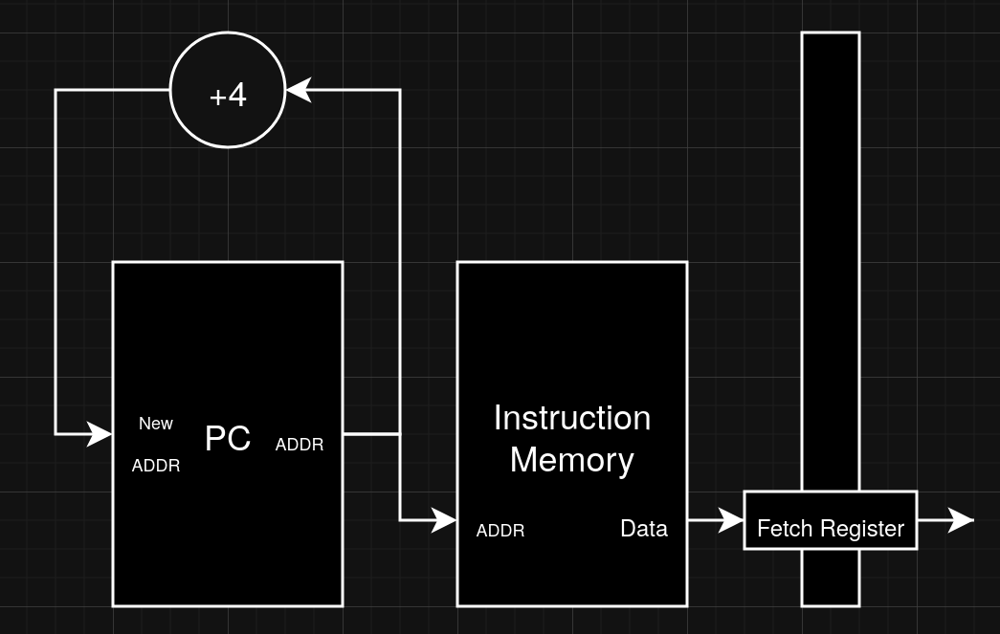
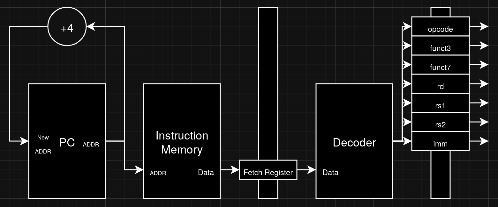
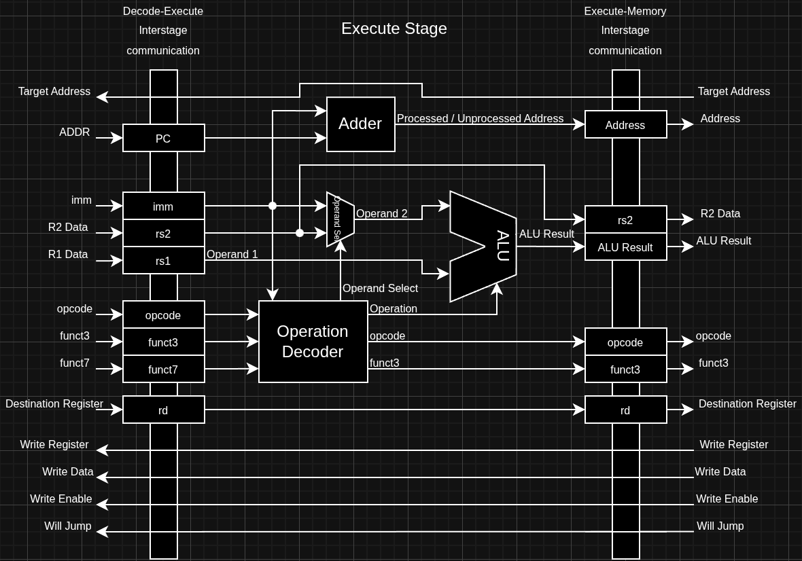
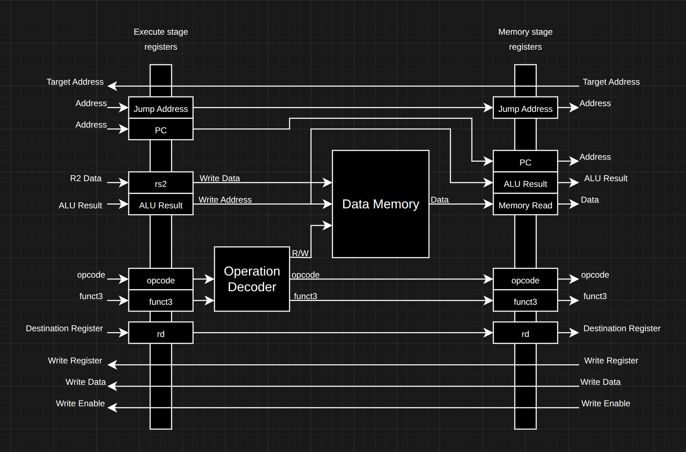
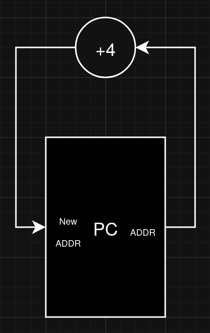
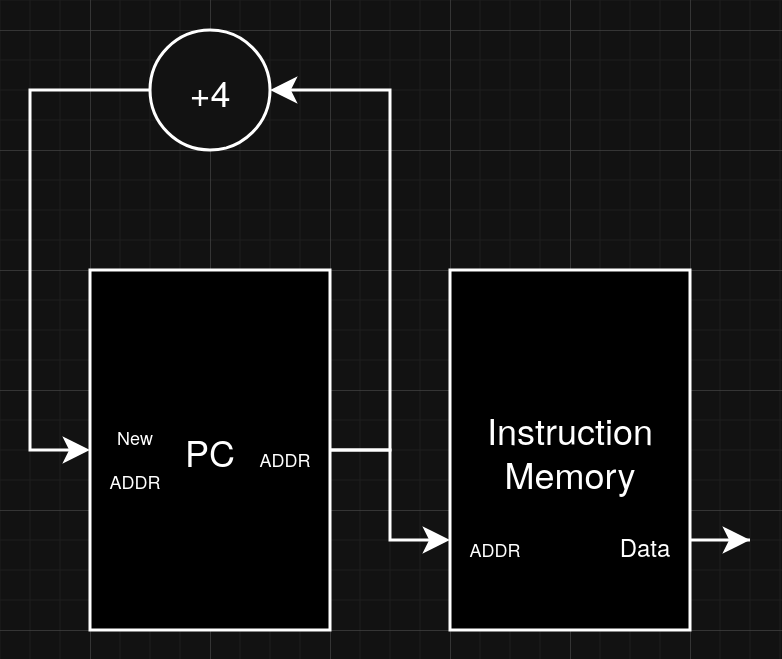
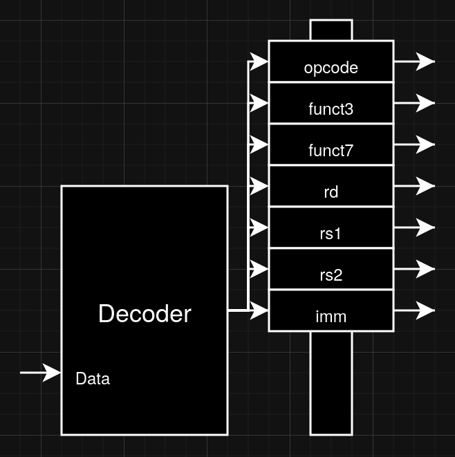

# Architecture
This section will be about the ISA, which C0 is based on. Essentially, what the CPU does. 
C0's architecture is based on RISC-V ISA, specifically [rv32i](https://docs.riscv.org/reference/isa/unpriv/rv32.html) with no extensions or custom instructions. 
This architecture is more of a CPU understanding foundation for me rather than a fully functional CPU. So, I've decided to cut out most modern Processor features and design techniques, resulting in only 37 instructions from rv32i's 40 unique instructions (replace `FENCE` and `SYSTEM` instruction group with `NOP`). 

## Registers
Registers of C0 have the same registers as [rv32i](https://docs.riscv.org/reference/isa/unpriv/rv32.html) registers, meaning that in C0 there will be a total of 32 registers (not counting program counter, of course). 

The following table will list all 32 registers and its description from [RISC-V ABI document](https://docs.riscv.org/reference/abi/riscv-cc-register-convention.html). 
> [!NOTE]
> RISC-V actually specified that all 32 registers are actually a general purpose register, meaning you could use all registers for anything you like. But, ABI (which is also specified by RISC-V) is like a common agreement on how to write codes for RISC-V, and it specifies the purpose of each register, so it is probably better to stick to ABI instead of using all 32 registers for whatever you want.

| Register  | ABI Mnemonic  | Description                               | Saved by  |
|-----------|---------------|-------------------------------------------|-----------|
| x0        | zero          | Constant zero register                    |           |
| x1        | ra            | Return address                            | Caller    |
| x2        | sp            | Stack pointer                             | Callee    |
| x3        | gp            | Global pointer                            |           |
| x4        | tp            | Thread pointer                            |           |
| x5 - x7   | t0 - t2       | Temporaries registers                     | Caller    |
| x8        | s0 - s1       | Callee-saved registers / Frame Pointer    | Callee    |
| x9        | s0 - s1       | Callee-saved registers                    | Callee    |
| x10 - x17 | a0 - a7       | Argument registers                        | Caller    |
| x18 - x27 | s2 - s11      | Callee-saved registers                    | Callee    |
| x28 - x31 | t3 - t6       | Temporaries registers                     | Caller    |

The `Saved by` column have been taken from [Wikipedia](https://en.wikipedia.org/wiki/RISC-V#Register_sets).  

`Saved by` column referred to which part of the code is responsible for storing data from those register to somewhere else (usually the stack) before calling any function. 

`Saved by Caller` means the code that called the function is responsible for storing data from registers before calling a function, this is due to the freedom of being able to overwrite data given to the function. 

While `Saved by Callee` means the function is the one responsible for storing the data inside registers before overwriting anyone of them, and also restore the value back to being the same as before. 

## Instruction Formats
There are a total of 6 instruction formats specified by RISC-V, the table below contains all those formats. 

> [!NOTE]
> If you're new to CPU architecture (just like me), instruction formats tell the CPU about where to find the operand, value it needs to use, what address it needs to jump to, etc...

 
Image taken from [RISC-V specification document](https://docs.riscv.org/reference/isa/_attachments/riscv-unprivileged.pdf). 

The following are the full name of each format.
- R-type: Register / Register
- I-type: Immediate
- S-type: Store
- B-type: Branch
- U-type: Upper immediate
- J-type: Jump

### Opcode field
`opcode` field is use determine the instruction group or whether the instruction is immediate or not, while the `funct3` and `funct7` are used to determine the specific function inside the group. 

### Register field
`rs1` and `rs2` (source) is the register where the operand are located, while `rd` (destination) are used to specify the register where the output of that instruction will be saved to. 

### Immediate field
For the `imm` field, this field is use as a direct value use for computation instead of value in a register. In the table, the `imm` is always followed by [...], this is to indicate the position in the final value that will be used by the processor. After all the bits are in their position, the processor will automatically sign-extended the data to become 32-bits. 
Some format with some instruction might do something before extending to 32-bits, like B-type which add 0 to the end before extending. This type of stuff will be explained in the next section of some instruction group. 
> [!NOTE]
> By the way, when programming on RISC-V, the assembler should handle the bit positioning for you, so don't worry about this stuff too much.

For example, let's say there is a B-type instruction, with this as their immediate field 
| 1 | 2 | 3 | 4 | 5 | 6 | 7 | ... | ... | ... | 8 | 9 | 0 | a | b | ... |
|---|---|---|---|---|---|---|-----|-----|-----|---|---|---|---|---|-----|

(`1` and `0` in this situation really means it in binary in this situation, but other value can be anything that is `1` or `0`. I just want to make it easier to identify each bit.) 

The product of swapping each bit to its correspond position would be `1b234567890a`. 
Next, because this is B-type format, 0 would be added to the back, resulting in `1b234567890a0` as a product. 
Finally, the sign will be extended to 32-bits, the final value will be `11111111111111111111b234567890a0`, because this is sign-extended the remainings 19-bits would be 1. 

## Instruction Groups
C0 instructions are grouped into multiple groups sorted by their function. This section will be going over all of them. 
Some groups may have multiple forms of the same instruction depend on the instruction format, or may have multiple subgroup that do completely difference thing with difference instruction format. But all in all, the opcode would be different, even though they belong to the same group 
### Arithmetic and Logic
> [!NOTE]
> The difference between logical and arithmetic shift is that arithmetic will shift while preserving the signed status, essentially just a true divided by 2^n instead of just divided by 2^n without caring about being signed or not.
#### R-type
The opcode for these instructions would be `0110011` 
| funct 7   | funct 3   | mnemonic  | operation                         | description                                           |
|-----------|-----------|-----------|-----------------------------------|-------------------------------------------------------|
| 0000000   | 000       | ADD       | rd = `rs1` + `rs2`                | add `rs2` to `rs1`                                    |
| 0100000   | 000       | SUB       | rd = `rs1` - `rs2`                | subtract `rs2` from `rs1`                             |
| -         | 001       | SLL       | rd = `rs1` << `rs2`               | logical shift `rs1` left by `rs2`                     |
| -         | 010       | SLT       | rd = `rs1` < `rs2` (signed)       | is `rs1` less than `rs2` (compare signed version)     |
| -         | 011       | SLTU      | rd = `rs1` < `rs2` (unsigned)     | is `rs1` less than `rs2` (compare unsigned version)   |
| -         | 100       | XOR       | rd = `rs1` ^ `rs2`                | bitwise xor                                           |
| 0000000   | 101       | SRL       | rd = `rs1` >> `rs2` (logical)     | logical shift `rs1` right by `rs2`                    |
| 0100000   | 101       | SRA       | rd = `rs1` >>> `rs2` (arithmetic) | arithmetic shift `rs1` right by `rs2`                 |
| -         | 110       | OR        | rd = `rs1` \| `rs2`               | bitwise or                                            |
| -         | 111       | AND       | rd = `rs1` & `rs2`                | bitwise and                                           |
#### I-type
The opcode for these instructions would be `0010011` 

For SLLI, SRLI and SRAI, the encoding of the I-type format is a little bit different from the normal I-type. The image below is how the "special" I-type format are encoded. 
 
Image taken from [RISC-V specification document](https://docs.riscv.org/reference/isa/_attachments/riscv-unprivileged.pdf). 
I love to think that field of bits ranging from bit 25 to 31 are used like funct 7 field from R-type format, while bit 20 to 24 are use as normal immediate field for shifting values. This field is called shamt in the official RISC-V specification, I would also be using those in the table. 

In the table, the "imm" would be referring to the entire 12 bits immediate filed. 
| funct 7 (bit 25 - 31) | funct 3   | mnemonic  | operation                         | description                                       |
|-----------------------|-----------|-----------|-----------------------------------|---------------------------------------------------|
| -                     | 000       | ADDI      | rd = `rs1` + imm                  | add imm to `rs1`                                  |
| -                     | 001       | SLLI      | rd = `rs1` << shamt               | logical shift `rs1` left by shamt                 |
| -                     | 010       | SLTI      | rd = `rs1` < imm (signed)         | is `rs1` less than imm (compare signed version)   |
| -                     | 011       | SLTUI     | rd = `rs1` < imm (unsigned)       | is `rs1` less than imm (compare unsigned version) |
| -                     | 100       | XORI      | rd = `rs1` ^ imm                  | bitwise xor                                       |
| 0000000               | 101       | SRLI      | rd = `rs1` >> shamt (logical)     | logical shift `rs1` right by shamt                |
| 0100000               | 101       | SRAI      | rd = `rs1` >>> shamt (arithmetic) | arithmetic shift `rs1` right by shamt             |
| -                     | 110       | ORI       | rd = `rs1` \| imm                 | bitwise or                                        |
| -                     | 111       | ANDI      | rd = `rs1` & imm                  | bitwise and                                       |
### Load and Store
#### Load (I-type)
For these operations, they're used for loading some amount of bits from memory to `rd`. 
The effective address of that memory is calculated by adding value from `rs1` to immediate field that have been sign-extended. 

For specific amount of bits that would be loaded, there will be a column for that in the table below called `load size` column. 

Opcode for these instructions would be `0000011`. 
| funct 3   | mnemonic  | load size | note                      |
|-----------|-----------|-----------|---------------------------|
| 000       | LB        | 8         | sign-extended to 32-bits  |
| 001       | LH        | 16        | sign-extended to 32-bits  |
| 010       | LW        | 32        | -                         |
| 100       | LBU       | 8         | zero extended to 32-bits  |
| 101       | LHU       | 16        | zero extended to 32-bits  |
#### Store (S-type)
For store group, these instructions copy the last ... bits (specify in `store size` column) from `rs2` to memory. 
The effective address of the memory for these instructions use the same way of calculating as the load group. The immediate field of S-type format mights be a bit wonky to look at. 

Opcode for these instructions would be `0100011`. 
| funct 3   | mnemonic  | store size |
|-----------|-----------|-----------|
| 000       | SB        | 8         |
| 001       | SH        | 16        |
| 010       | SW        | 32        |
### Jump
#### Conditional Jump (Branch, B-type)
This group of instructions will add specific number to the program counter of the processor to jump to new instruction address, when a condition of instruction is met. Effectively, an if-else instruction. 
Number of offset that would be added to program counter is within the range of ±4KiB. This offset is encoded in the 12-bits immediate field of B-type format. The reason for the 12-bits field to have a range of ±4KiB is that the immediate field will be left shift then sign-extended to 32-bits. This satisfied RISC-V's requirement for the offset to be multiples of 2. 

The opcode for this instruction group would be `1100011`. 
| funct 3   | mnemonic  | description                                               |
|-----------|-----------|-----------------------------------------------------------|
| 000       | BEQ       | branch if `rs1` and `rs2` are equal                       |
| 001       | BNE       | branch if `rs1` and `rs2` are not equal                   |
| 100       | BLT       | branch if `rs1` is less than `rs2` (signed version)       |
| 101       | BGE       | branch if `rs1` is greater than `rs2` (signed version)    |
| 110       | BLTU      | branch if `rs1` is less than `rs2` (unsigned version)     |
| 111       | BGEU      | branch if `rs1` is greater than `rs2` (unsigned version)  |
#### Unconditional Jump
This type of jump will also add specific number to the program counter, to jump to specific instruction. But, this type of jump will always occur, there is no check if a condition is met. This is use for something like returning from a function. 
This group of instructions contains two instructions, both use difference opcode and instruction format. They are listed down below.
##### JAL (J-type)
This instruction use J-type instruction format. Like the B-type instruction format, 0 is also added to the end of the immediate value and signed-extended. 
This immediate value is use as an offset to jump to from current address by adding the offset to the program counter. The range for the offset is ±1MiB. This instruction also save current instruction address (before jumping) with 4 (bytes) added to, to any register specify in `rd`, but following ABI specification this should be x1 or return address register, or you can use x0 which is constant zero register if you want to discard the address. 
Opcode for `JAL` instruction is `1101111`. 
##### JALR (I-type)
`JALR` is I-type instruction format instead of J-type, and instead of using an offset to jump to specific instruction address, this instruction use fixed address obtain by adding the value from the immediate field that have been sign-extended to 32-bits to value from `rs1`, then the last bit's value will be set to 0. The program counter is then set to this value. The x1 register is also used by the instruction to save the address before jumping with 4 added to, just like `JAL`. 
Opcode for `JALR` instruction is `1100111`, and it uses I-type instruction format.
### Upper Immediate
This group contains two instructions just like Unconditional Jump group. Job of this group's instructions is to load upper 20-bits of immediate value to target register. 
This instruction group use U-type format, but there are two difference opcodes for each of the instruction. 
#### LUI
`LUI` loads first 20-bits then left shift those 20-bits into 32-bits into `rd`. When shifting, zero will be added to the left. 
The opcode for this instruction is `0110111`. 
#### AUIPC
`AUIPC` pretty much does what `LUI` does, but added the current value from program counter before loading into `rd`. 
This instruction use `0010111` as its opcode. 

# Microarchitecture
For this section, I'll be talking a little bit more about the hardware now. It's now, how will the CPU do it. 
As I said in the first section, I've cut out most modern processor design feature and technique. This also includes hardware stuff, like I/O, interrupts, cache, being in-order execution, and superscalar design. This will result in 1 instruction per clock cycles (and it should stucks at 1 instruction per cycle) from no instruction level parallelism, and almost no use, but this is why there is 0 in C0. 

## Instruction Cycle
Instruction cycle are processes the CPU have to take to complete the execution of an instruction. In C0, there are 5 stages of instruction cycle. They follow classic RISC style instruction cycle, there are 
1. Fetch (IF)
    * The processor fetches an instruction from a memory, the address of an instruction is taken from processor's [program counter](#program-counter).
2. Decode (ID)
    * The instruction is decoded by the CPU. This process tells the CPU what is the instruction format, opcode, func3/7, the registers and others.
3. Execute (EX)
    * The information is passed from Decode stage into this stage to do all sort of calculation (except operation that interact with memory, but address calculation will be doing here).
4. Memory (MEM)
    * This stage is exclusively made for Load and Store group. After address calculation have been done by the execution stage, this stage took that address to interact with the memory.
5. Writeback (WB)
    * If required, the result will be written back to register at this stage.

## Instruction Pipeline
Instruction pipeline is a technique use to increase execution speed of a processor, it is done by taking instruction cycle from section above then stack multiple instruction cycles on top of each other with an offset of 1 clock cycle. Doing this make every stage of the cycle (almost) always busy making performance much higher. 

Two tables below is the comparison between processor that didn't implement instruction pipeline and one that did. 
<table>
  <tr>
    <th rowspan="2">Instruction</th>
    <th colspan="15">Clock cycle no.</th>
  </tr>
  <tr>
    <th>1</th>
    <th>2</th>
    <th>3</th>
    <th>4</th>
    <th>5</th>
    <th>6</th>
    <th>7</th>
    <th>8</th>
    <th>9</th>
    <th>10</th>
    <th>11</th>
    <th>12</th>
    <th>13</th>
    <th>14</th>
    <th>15</th>
  </tr>
  <tr>
    <td>Instruction 1</td>
    <td>IF</td>
    <td>ID</td>
    <td>EX</td>
    <td>MEM</td>
    <td>WB</td>
    <td></td>
    <td></td>
    <td></td>
    <td></td>
    <td></td>
    <td></td>
    <td></td>
    <td></td>
    <td></td>
    <td></td>
  </tr>
  <tr>
    <td>Instruction 2</td>
    <td></td>
    <td></td>
    <td></td>
    <td></td>
    <td></td>
    <td>IF</td>
    <td>ID</td>
    <td>EX</td>
    <td>MEM</td>
    <td>WB</td>
    <td></td>
    <td></td>
    <td></td>
    <td></td>
    <td></td>
  </tr>
  <tr>
    <td>Instruction 3</td>
    <td></td>
    <td></td>
    <td></td>
    <td></td>
    <td></td>
    <td></td>
    <td></td>
    <td></td>
    <td></td>
    <td></td>
    <td>IF</td>
    <td>ID</td>
    <td>EX</td>
    <td>MEM</td>
    <td>WB</td>
  </tr>
</table>
Processor that didn't implement instruction pipeline. 
<table>
  <tr>
    <th rowspan="2">Instruction</th>
    <th colspan="7">Clock cycle no.</th>
  </tr>
  <tr>
    <th>1</th>
    <th>2</th>
    <th>3</th>
    <th>4</th>
    <th>5</th>
    <th>6</th>
    <th>7</th>
  </tr>
  <tr>
    <td>Instruction 1</td>
    <td>IF</td>
    <td>ID</td>
    <td>EX</td>
    <td>MEM</td>
    <td>WB</td>
    <td></td>
    <td></td>
  </tr>
  <tr>
    <td>Instruction 2</td>
    <td></td>
    <td>IF</td>
    <td>ID</td>
    <td>EX</td>
    <td>MEM</td>
    <td>WB</td>
    <td></td>
  </tr>
  <tr>
    <td>Instruction 3</td>
    <td></td>
    <td></td>
    <td>IF</td>
    <td>ID</td>
    <td>EX</td>
    <td>MEM</td>
    <td>WB</td>
  </tr>
</table>
Processor that did implement instruction pipeline. 

As you can see, processor with instruction pipeline complete all instruction execution in just 7 clock cycles, while the one that didn't need 15 clock cycles. 
### Challenge
But instruction pipeline comes with a catch, the easiest one to thinks about is branch or jump instruction. These instructions wouldn't change [program counter](#program-counter)'s value until their finish, but by then four instructions would already be fetched for their own execution. There are more problems can cause by instruction pipeline, but anyway these problems are call "Hazards". You can find more information on [Wikipedia](https://en.wikipedia.org/wiki/Hazard_(computer_architecture)) 

## Datapath
Datapath is a physical implementation instruction cycle. The datapath are divided into 5 stages correspond for the stages specified in [instruction cycle](#instruction-cycle). As said before, the datapath is pipelined, meaning that, at every ending part of each stage (except the writeback stage) will have a set of registers to hold the data from that stage and forward those to the next at the next clock cycle. 

 
Entire datapath. 

### Fetch Stage (IF)
 
### Decode Stage (ID)
 
### Execute Stage (EX)
 
### Memory Stage (MEM)
 
### Writeback Stage (WB)
 

<!-- ## Datapath
Each of these stages took 1 clock cycle to complete, this type of instruction execution where multiple clock cycles are required to complete one instruction is called "multi-cycle datapath". 
At the end of each stage (except WB stage), there will be a set of registers for passing data from one stage to another. 

 
Image of C0's entire datapath. 

Below will be about each stage (I omit clock port on all diagram), and the datapath which is just a diagram of how the processor will retrieve instruction and process it. 
### Fetch
The processor use a component called program counter to keep track of the current instruction that the processor need to execute. If everything goes right the program counter will add 4 to itself to jump to next instruction, which is 4 bytes away. 
 
Then we need to hook the program counter to some sort of instruction memory, it could be cache, RAM or ROM, so that the processor can get the instruction. 
 
Being multi-cycle datapath, it needs register to hold the data retrieved from instruction memory for next stage. If we didn't have this register it would just turn into single-cycle, which due to performance reason (memory latency, and some other reasons) it is inferior to multi-cycle. Each stage register will be a tall rectangle to separate each stage. 
 

### Decode
After we got instruction from the memory, we need to decode it to identify the instruction format, and separate all the information contain inside the instruction. Let's also give the decoder an ability to assemble immediate field according to the instruction format. 
 
This part is usually handles by some sort of decoder, then of course we need more registers to hold the information for next stage. 
 
This is now the datapath we construct. 

### Execute
In this stage, we took all the information from last stage, select the designated register, then put all that information through ALU. 

Let's start off by selecting the designated register. 
Registers are grouped in register file, 

 

### Memory
 

### Writeback
  -->

<!-- C0 implement the 5 stages instruction pipelines that many RISC CPU utilize, instruction pipeline increase CPU performance by overlapping the execution of multiple instructions. For each instruction, the execution of that instruction will be divided into 5 stages, these are 

The following image is the diagram of the processor. 
 
The sections down below will be over how each component work. I've written each section in order how the processor retrieves instruction and execute it. 

## Virtual Memory
Normal processor doesn't have this part, but I've decided that writing a real DRAM and I/O controller would be a bit too hard for me, so I write this virtual memory using FPGA's BRAM. This is also the reason why I named the CPU C0, because I did not intend it to be a normal working CPU. 

Anyway, the working of each memory is quite straight forward. There is 32-bits address line, 32-bits bidirectional data line, read line and there is also a write line for RAM. 
More description for each memory will be down below. 
### RAM
### ROM

## Control Unit
Control Unit (CU) doesn't execute the instruction directly, but it acts as an orchestrator that control the flow of instruction execution. 
That cycle is called instruction pipeline. In C0, the instruction pipeline follows RISC style instruction pipeline, with 5 stages.
### Program Counter
### Instruction Decoder

## Bus

## Register File

## Arithmetic and Logic Unit
### Operation Decoder

## Load-Store Unit
### Operation Decoder -->