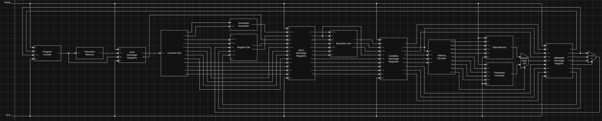
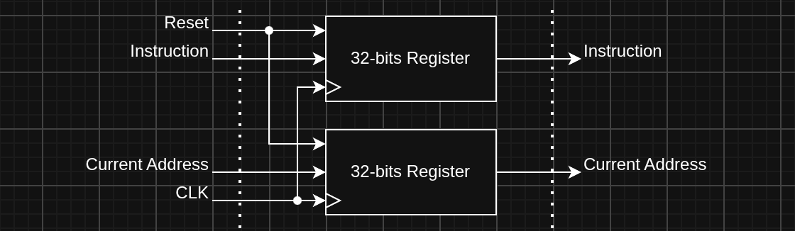
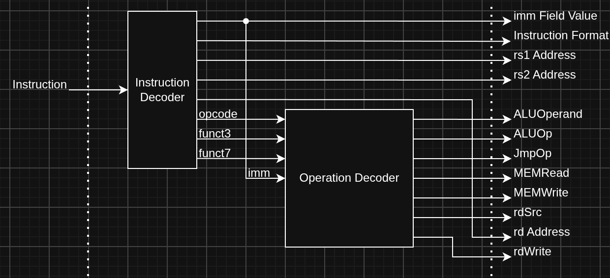
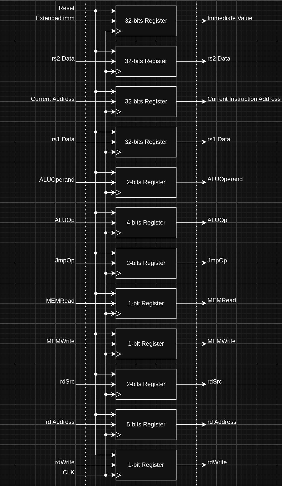
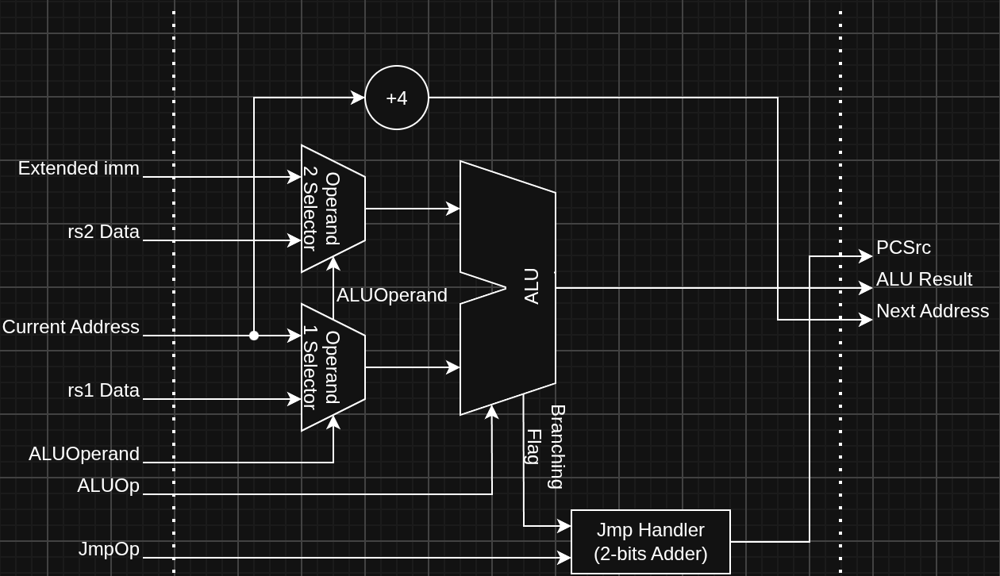
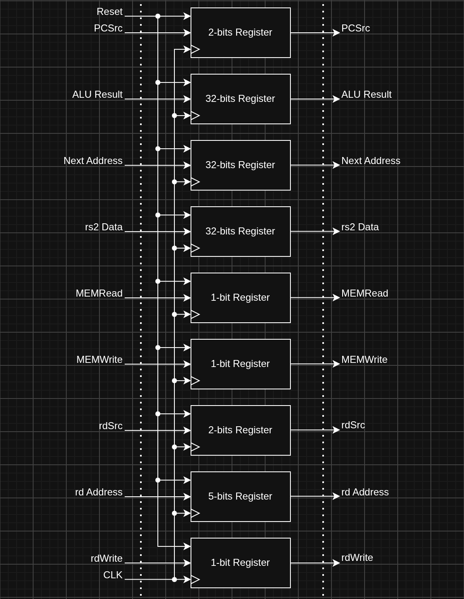
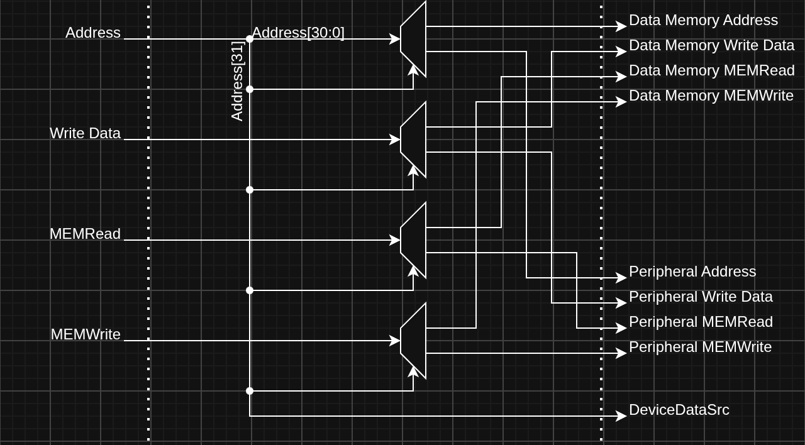
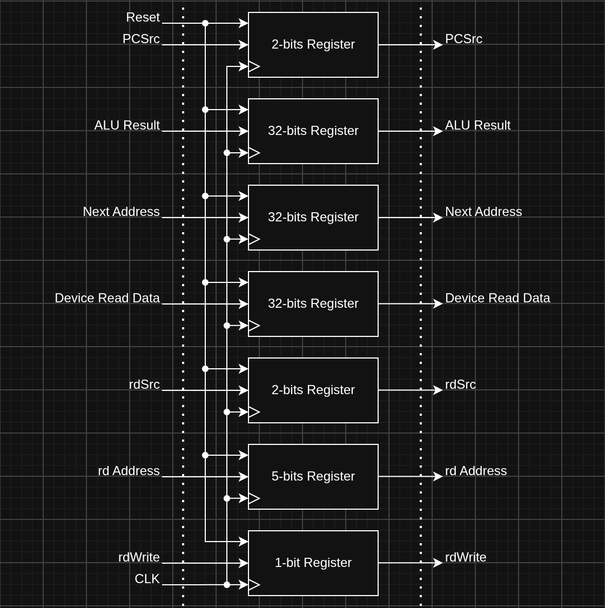

# Architecture
This section will be about the ISA, which C0 is based on. Essentially, what the CPU does. 

C0's ISA is based on RISC-V ISA, specifically [rv32i](https://docs.riscv.org/reference/isa/unpriv/rv32.html) with no extensions or custom instructions. 
This architecture is more of a CPU understanding foundation for me rather than a fully functional CPU. So, I've decided to cut out most modern processor features and design techniques, resulting in only 37 instructions from rv32i's 40 unique instructions (replace `FENCE` and `SYSTEM` instruction group with `NOP`). 

## Registers
C0 have the same registers as the rv32i specification. In the rv32i, there are 32 registers, first one is constant zero register, and the other 31 are general purpose. 
The following section utilizes [RISC-V ABI document](https://docs.riscv.org/reference/abi/riscv-cc-register-convention.html) to determine the purpose for each register when programming the CPU, but feel free to read the following section if you're curious to. 

> [!NOTE]
> ABI is like a standard convention on how to write code for RISC-V CPU specified by RISC-V.

| Register  | ABI Mnemonic  | Description                               | Saved by  |
|-----------|---------------|-------------------------------------------|-----------|
| x0        | zero          | Constant zero                             | na        |
| x1        | ra            | Return address                            | Caller    |
| x2        | sp            | Stack pointer                             | Callee    |
| x3        | gp            | Global pointer                            | na        |
| x4        | tp            | Thread pointer                            | na        |
| x5 - x7   | t0 - t2       | Temporaries registers                     | Caller    |
| x8        | s0 / fp       | Callee-saved registers / Frame Pointer    | Callee    |
| x9        | s1            | Callee-saved register                     | Callee    |
| x10 - x17 | a0 - a7       | Argument registers                        | Caller    |
| x18 - x27 | s2 - s11      | Callee-saved registers                    | Callee    |
| x28 - x31 | t3 - t6       | Temporaries registers                     | Caller    |

The `Saved by` column have been taken from [Wikipedia](https://en.wikipedia.org/wiki/RISC-V#Register_sets).  

### Register types
1. Constant Zero Register
    - This type of register have it value always set to 0. This might sound useless, but this register enabled the functionality of `NOP` psuedoinstruction, which add 0 to 0 into register 0.
2. Return Address Register
    - This register hold the value of address to jump to after finish executing current function.
3. Stack Pointer Register
    - This register points to the very top of the stack.
4. Global Pointer Register
    - Global pointer points to the middle of all global variables live. The reason for pointing to the middle is so that there is no need to store full 32-bits address, instead it can access specific variable with a little bit of offset to global pointer.
5. Thread Pointer Register
    - Thread pointer points to current thread's thread-local storage. This register act as that pointer.
6. Frame Pointer Register
    - This register points to a specific place inside the stack. It always points to the very bottom of current function's frame.
7. Temporary Register
    - These register is free to use for anything, the only catch to these registers is that caller must save data from these registers to somewhere before calling a function.
8. Callee-Saved Register
    - This is similar to Temporary Register, but as the name imply, callee is now responsible for saving and restoring the original data on these register before jumping back to the parent function that called this function.
9. Argument Register
    - Argument Registers are used to pass function arguments, but sometimes, these registers are also used to pass return values from a function back to it caller.
### Saved by types
`Saved by` column referred to which part of the code is responsible for storing data from those register to somewhere else (usually the stack) before calling a function. 
1. Saved by Caller
    - This means the code that called a function is responsible for storing data from registers before calling a function.
2. Saved by Callee
    - This means the function being called is the one responsible for storing the data inside these registers, and restore the value back to being the same as before calling the function.

## Instruction Formats
There are a total of 6 instruction formats specified by RISC-V, the table below contains all those formats. 

> [!NOTE]
> If you're new to CPU architecture (just like me), instruction formats tell the CPU about where to find the operand, value it needs to use, what address it needs to jump to, etc...

 
Image taken from [RISC-V specification document](https://docs.riscv.org/reference/isa/_attachments/riscv-unprivileged.pdf). 

The following are the full name of each format.
- R-type: Register / Register
- I-type: Immediate
- S-type: Store
- B-type: Branch
- U-type: Upper immediate
- J-type: Jump

### Opcode field
`opcode` field is use determine the instruction group or whether the instruction is immediate or not, while the `funct3` and `funct7` are used to determine the specific function inside the group. 

### Register field
`rs1` and `rs2` (source) is the register where the operand are located, while `rd` (destination) are used to specify the register where the output of that instruction will be saved to. 

### Immediate field
For the `imm` field, value from this field is used directly for computation instead of value from a register. In the table, the `imm` is always followed by [...], this is to indicate the position in the final value that will be used by the processor.
After all the bits are in their position, the processor will automatically sign-extended the immediate value into 32-bits value. 
Some format with some instruction might do something before extending to 32-bits, like B-type which add 0 to the end before extending. This type of stuff will be explained in the next section of some instruction group. 

The table below shows how the processor position each immediate bit. imm[11] of I-type in the table is as the same as in the instruction format above, this also apply to all other imm[...] 
<table>
  <tr>
    <th rowspan="2">Instruction Format</th>
    <th colspan="32">Bit no.</th>
  </tr>
  <tr>
    <th>31</th>
    <th>30</th>
    <th>29</th>
    <th>28</th>
    <th>27</th>
    <th>26</th>
    <th>25</th>
    <th>24</th>
    <th>23</th>
    <th>22</th>
    <th>21</th>
    <th>20</th>
    <th>19</th>
    <th>18</th>
    <th>17</th>
    <th>16</th>
    <th>15</th>
    <th>14</th>
    <th>13</th>
    <th>12</th>
    <th>11</th>
    <th>10</th>
    <th>9</th>
    <th>8</th>
    <th>7</th>
    <th>6</th>
    <th>5</th>
    <th>4</th>
    <th>3</th>
    <th>2</th>
    <th>1</th>
    <th>0</th>
  </tr>
  <tr>
    <td>I-type</td>
    <td colspan="20">Signed-extended into 32-bits</td>
    <td colspan="12">imm[11:0]</td>
  </tr>
  <tr>
    <td>S-type</td>
    <td colspan="20">Signed-extended into 32-bits</td>
    <td colspan="7">imm[11:5]</td>
    <td colspan="5">imm[4:0]</td>
  </tr>
  <tr>
    <td>B-type</td>
    <td colspan="19">Signed-extended into 32-bits</td>
    <td>imm[12]</td>
    <td>imm[11]</td>
    <td colspan="6">imm[10:5]</td>
    <td colspan="4">imm[4:1]</td>
    <td>0</td>
  </tr>
  <tr>
    <td>U-type</td>
    <td colspan="20">imm[31:12]</td>
    <td>0</td>
    <td>0</td>
    <td>0</td>
    <td>0</td>
    <td>0</td>
    <td>0</td>
    <td>0</td>
    <td>0</td>
    <td>0</td>
    <td>0</td>
    <td>0</td>
    <td>0</td>
  </tr>
  <tr>
    <td>J-type</td>
    <td colspan="11">Signed-extended into 32-bits</td>
    <td>imm[20]</td>
    <td colspan="8">imm[19:12]</td>
    <td>imm[11]</td>
    <td colspan="10">imm[10:1]</td>
    <td>0</td>
  </tr>
</table>

> [!NOTE]
> By the way, when programming on RISC-V, the assembler should handle the bit positioning for you, so don't worry about this stuff too much.

For example, let's say there is a B-type instruction, with this as their immediate field 
| 1 | 2 | 3 | 4 | 5 | 6 | 7 | ... | ... | ... | 8 | 9 | 0 | a | b | ... |
|---|---|---|---|---|---|---|-----|-----|-----|---|---|---|---|---|-----|

(`1` and `0` in this situation really means it in binary in this situation, but other value can be anything that is `1` or `0`. I just want to make it easier to identify each bit.) 

The product of swapping each bit to its correspond position would be `1b234567890a`. 
Next, because this is B-type format, 0 would be added to the back, resulting in `1b234567890a0` as a product. 
Finally, the sign will be extended to 32-bits, the final value will be `11111111111111111111b234567890a0`, because this is sign-extended the remainings 19-bits would be 1. 

## Instruction Groups
C0 instructions are grouped into multiple groups sorted by their function. This section will be going over all of them. 
Some groups may have multiple forms of the same instruction depend on the instruction format, or may have multiple subgroup that do completely difference thing with difference instruction format. But all in all, the `opcode` would be different, even though they belong to the same group 
### Arithmetic and Logic
> [!NOTE]
> The difference between logical and arithmetic shift is that arithmetic will shift, while preserving the signed status, essentially just a true divided by 2^n instead of just divided by 2^n without caring about being signed or not.
#### R-type
The `opcode` for these instructions would be `0110011` 
| `funct7`  | `funct3`  | mnemonic  | operation                         | description                                           |
|-----------|-----------|-----------|-----------------------------------|-------------------------------------------------------|
| 0000000   | 000       | ADD       | rd = `rs1` + `rs2`                | add `rs2` to `rs1`                                    |
| 0100000   | 000       | SUB       | rd = `rs1` - `rs2`                | subtract `rs2` from `rs1`                             |
| -         | 001       | SLL       | rd = `rs1` << `rs2`               | logical shift `rs1` left by `rs2`                     |
| -         | 010       | SLT       | rd = `rs1` < `rs2` (signed)       | is `rs1` less than `rs2` (compare signed version)     |
| -         | 011       | SLTU      | rd = `rs1` < `rs2` (unsigned)     | is `rs1` less than `rs2` (compare unsigned version)   |
| -         | 100       | XOR       | rd = `rs1` ^ `rs2`                | bitwise xor                                           |
| 0000000   | 101       | SRL       | rd = `rs1` >> `rs2` (logical)     | logical shift `rs1` right by `rs2`                    |
| 0100000   | 101       | SRA       | rd = `rs1` >>> `rs2` (arithmetic) | arithmetic shift `rs1` right by `rs2`                 |
| -         | 110       | OR        | rd = `rs1` \| `rs2`               | bitwise or                                            |
| -         | 111       | AND       | rd = `rs1` & `rs2`                | bitwise and                                           |
#### I-type
The `opcode` for these instructions would be `0010011` 

For SLLI, SRLI and SRAI, the encoding of the I-type format is a little bit different from the normal I-type. The image below is how the "special" I-type format are encoded. 
 
Image taken from [RISC-V specification document](https://docs.riscv.org/reference/isa/_attachments/riscv-unprivileged.pdf). 
I love to think that immediate field ranging from bit 31 down to bit 25 in the special format are used like `funct7` field, while bit 20 up to bit 24 are use as normal immediate field for shifting values. 

In the table below, there would be either "imm" or "shamt" as a second operand.
"imm" implys that the instruction use full 12-bits immediate value as the second operand, while "shamt" means that the processor use only last 5-bits from the immediate value of the "special" I-type format as the second operand. 

| `funct7` (bit 31 - 25)| `funct3`  | mnemonic  | operation                         | description                                       |
|-----------------------|-----------|-----------|-----------------------------------|---------------------------------------------------|
| -                     | 000       | ADDI      | rd = `rs1` + imm                  | add imm to `rs1`                                  |
| 0000000               | 001       | SLLI      | rd = `rs1` << shamt               | logical shift `rs1` left by shamt                 |
| -                     | 010       | SLTI      | rd = `rs1` < imm (signed)         | is `rs1` less than imm (compare signed version)   |
| -                     | 011       | SLTUI     | rd = `rs1` < imm (unsigned)       | is `rs1` less than imm (compare unsigned version) |
| -                     | 100       | XORI      | rd = `rs1` ^ imm                  | bitwise xor                                       |
| 0000000               | 101       | SRLI      | rd = `rs1` >> shamt (logical)     | logical shift `rs1` right by shamt                |
| 0100000               | 101       | SRAI      | rd = `rs1` >>> shamt (arithmetic) | arithmetic shift `rs1` right by shamt             |
| -                     | 110       | ORI       | rd = `rs1` \| imm                 | bitwise or                                        |
| -                     | 111       | ANDI      | rd = `rs1` & imm                  | bitwise and                                       |

### Load and Store
#### Load (I-type)
For these operations, they're used for loading some amount of bits from memory to `rd`. 
The effective address of that memory is calculated by adding value from `rs1` to immediate field that have been sign-extended, giving it an ability to offset ±2K addresses from `rs1`. 

For specific amount of bits that would be loaded, there will be a column for that in the table below called `load size` column. 

`opcode` for these instructions would be `0000011`. 
| `funct3`  | mnemonic  | load size | note                                    |
|-----------|-----------|-----------|-----------------------------------------|
| 000       | LB        | 8         | loaded data is sign-extended to 32-bits |
| 001       | LH        | 16        | loaded data is sign-extended to 32-bits |
| 010       | LW        | 32        | -                                       |
| 100       | LBU       | 8         | loaded data is zero extended to 32-bits |
| 101       | LHU       | 16        | loaded data is zero extended to 32-bits |
#### Store (S-type)
For store group, these instructions copy the last ... bits (specify in `store size` column) from `rs2` to memory. 
The effective address of the memory for these instructions use the same way of calculating as the load group, also giving it an ability to offset the address from `rs1` for ±2K addresses. The immediate field of S-type format mights be a bit wonky to look at, but it is the same as 12-bits field of I-type format, just placing differently. 

`opcode` for these instructions would be `0100011`. 
| `funct3`  | mnemonic  | store size |
|-----------|-----------|-----------|
| 000       | SB        | 8         |
| 001       | SH        | 16        |
| 010       | SW        | 32        |
### Jump
#### Conditional Jump (Branch, B-type)
This group of instructions will add specific number to the program counter of the processor to jump to new instruction address, when a condition of instruction is met. Effectively, an if-else instruction. 
Number of offset that would be added to program counter is within the range of ±4KiB. This offset is encoded in the 12-bits immediate field of B-type format. The reason for the 12-bits field to have a range of ±4KiB is that the immediate field will be left shift then sign-extended to 32-bits. This satisfied RISC-V's requirement for the offset to be multiples of 2. 

The `opcode` for this instruction group would be `1100011`. 
| `funct3`  | mnemonic  | description                                               |
|-----------|-----------|-----------------------------------------------------------|
| 000       | BEQ       | branch if `rs1` and `rs2` are equal                       |
| 001       | BNE       | branch if `rs1` and `rs2` are not equal                   |
| 100       | BLT       | branch if `rs1` is less than `rs2` (signed version)       |
| 101       | BGE       | branch if `rs1` is greater than `rs2` (signed version)    |
| 110       | BLTU      | branch if `rs1` is less than `rs2` (unsigned version)     |
| 111       | BGEU      | branch if `rs1` is greater than `rs2` (unsigned version)  |
#### Unconditional Jump
This type of jump will also add specific number to the program counter, to jump to specific instruction. But, this type of jump will always occur, there is no check if a condition is met. This is use for something like returning from a function. 
This group of instructions contains two instructions, both use difference `opcode` and instruction format. They are listed down below.
##### JAL (J-type)
This instruction use J-type instruction format. Like the B-type instruction format, 0 is also added to the end of the immediate value and signed-extended. 
This immediate value is use as an offset to jump to from current address by adding the offset to the program counter. The range for the offset is ±1MiB. This instruction also saves next instruction address (current + 4 bytes) to any register specify in `rd`, but following ABI specification this should be x1 or return address register, or you can use x0 which is constant zero register if you want to discard the address. 
`opcode` for `JAL` instruction is `1101111`. 
##### JALR (I-type)
`JALR` is I-type instruction format instead of J-type, and instead of using an offset to jump to specific instruction address, this instruction use fixed address obtain by adding the value from the immediate field that have been sign-extended to 32-bits to value from `rs1`, then the last bit's value will be set to 0 (not 0 added to the back). The program counter is then set to this value. The x1 register is also used by the instruction to save the next instruction address (current + 4 bytes), just like `JAL`. 
`opcode` for `JALR` instruction is `1100111`, and it uses I-type instruction format.
### Upper Immediate
This group contains two instructions just like Unconditional Jump group. Job of this group's instructions is to load upper 20-bits of immediate value to target register. 
This instruction group use U-type format, but there are two difference opcodes for each of the instruction. 
#### LUI
`LUI` loads first 20-bits then left shift those 20-bits into 32-bits into `rd`. When shifting, zero will be added to the right. 
The `opcode` for this instruction is `0110111`. 
#### AUIPC
`AUIPC` pretty much does what `LUI` does, but added the current value from program counter before loading into `rd`. 
This instruction use `0010111` as its `opcode`. 

# Microarchitecture
For this section, I'll be talking a little bit more about the hardware now. It's now, how will the CPU do it. 
As I said in the first section, I've cut out most modern processor design feature and technique. This also includes hardware stuff, like I/O, interrupts, cache, being in-order execution and superscalar design. This will result in 1 instruction per clock cycles (and it should stuck at 1 instruction per cycle) from no instruction level parallelism, but this is why there is 0 in C0. 

## Instruction Cycle
Instruction cycle are processes the CPU have to take to complete the execution of an instruction. In C0, there are 5 stages of instruction cycle. They follow classic RISC style instruction cycle, there are 
1. Fetch (IF)
    * The processor fetches an instruction from a memory, the address of an instruction is taken from processor's [Program Counter](#program-counter-pc).
2. Decode (ID)
    * The instruction is decoded by the CPU. This process tells the CPU what is the instruction wanted to do to which part of the processor. After decoding the instruction, the processor will receive `opcode` and `funct3/7`, this is then used to generate the signal for controlling the flow of the data throughout the cycles.
3. Execute (EX)
    * Every math and logic related operations happen in this stage (including calculating the jump address or memory address). The Control Signal for controlling the [ALU](#arithmetic-and-logic-unit-alu) is sent from the previous stage. This stage also generates new Control Signal that decided whether the processor wanted to jump or not.
4. Memory (MEM)
    * This stage is exclusively made for Load and Store group. After address calculation have been done by the execution stage, this stage took that address to interact with the memory (if the operation is memory interaction).
5. Writeback (WB)
    * If required, the result will be written back to the designated register at this stage.

## Instruction Pipeline
Instruction pipeline is a technique use to increase execution speed of a processor, it is done by taking instruction cycle from section above then stack multiple instruction cycles on top of each other with an offset of 1 clock cycle. Doing this make every stage of the cycle (almost) always busy making performance much higher. 

Two tables below is the comparison between processor that didn't implement instruction pipeline and one that did. 
<table>
  <tr>
    <th rowspan="2">Instruction</th>
    <th colspan="15">Clock cycle no.</th>
  </tr>
  <tr>
    <th>1</th>
    <th>2</th>
    <th>3</th>
    <th>4</th>
    <th>5</th>
    <th>6</th>
    <th>7</th>
    <th>8</th>
    <th>9</th>
    <th>10</th>
    <th>11</th>
    <th>12</th>
    <th>13</th>
    <th>14</th>
    <th>15</th>
  </tr>
  <tr>
    <td>Instruction 1</td>
    <td>IF</td>
    <td>ID</td>
    <td>EX</td>
    <td>MEM</td>
    <td>WB</td>
    <td></td>
    <td></td>
    <td></td>
    <td></td>
    <td></td>
    <td></td>
    <td></td>
    <td></td>
    <td></td>
    <td></td>
  </tr>
  <tr>
    <td>Instruction 2</td>
    <td></td>
    <td></td>
    <td></td>
    <td></td>
    <td></td>
    <td>IF</td>
    <td>ID</td>
    <td>EX</td>
    <td>MEM</td>
    <td>WB</td>
    <td></td>
    <td></td>
    <td></td>
    <td></td>
    <td></td>
  </tr>
  <tr>
    <td>Instruction 3</td>
    <td></td>
    <td></td>
    <td></td>
    <td></td>
    <td></td>
    <td></td>
    <td></td>
    <td></td>
    <td></td>
    <td></td>
    <td>IF</td>
    <td>ID</td>
    <td>EX</td>
    <td>MEM</td>
    <td>WB</td>
  </tr>
</table>
Processor that didn't implement instruction pipeline. 
<table>
  <tr>
    <th rowspan="2">Instruction</th>
    <th colspan="7">Clock cycle no.</th>
  </tr>
  <tr>
    <th>1</th>
    <th>2</th>
    <th>3</th>
    <th>4</th>
    <th>5</th>
    <th>6</th>
    <th>7</th>
  </tr>
  <tr>
    <td>Instruction 1</td>
    <td>IF</td>
    <td>ID</td>
    <td>EX</td>
    <td>MEM</td>
    <td>WB</td>
    <td></td>
    <td></td>
  </tr>
  <tr>
    <td>Instruction 2</td>
    <td></td>
    <td>IF</td>
    <td>ID</td>
    <td>EX</td>
    <td>MEM</td>
    <td>WB</td>
    <td></td>
  </tr>
  <tr>
    <td>Instruction 3</td>
    <td></td>
    <td></td>
    <td>IF</td>
    <td>ID</td>
    <td>EX</td>
    <td>MEM</td>
    <td>WB</td>
  </tr>
</table>
Processor that did implement instruction pipeline. 

As you can see, processor with instruction pipeline complete all instruction execution in just 7 clock cycles, while the one that didn't need 15 clock cycles. 
### Hazards
But instruction pipeline comes with a catch, because pipeline fetch a new instruction before knowing the outcome of the instruction before this one. These type of situations are called "Hazard". 
Usually hazards are handled by dedicated hardware unit like branch predictor, or design technique like superscalar design. But, in my design, I've decided to push all the responsibility to the programmer to switch the execution to instruction that aren't data dependent on other instruction, or to just call multiple `NOP` instructions before continuing the execution to keep the design simple. 

There are multiple types of hazards. I've written a brief description about them down below, if you're interested. 
#### Structural Hazards
This type of hazard occur when there are multiple instructions tried to use the same component, this won't occur in C0 though. This hazard can be fixed by implement same component multiple times which is called superscalar design. 
#### Data Hazards
Data hazard occur when one instruction depend on the result of another instruction that hasn't finished execute yet. 
#### Control Hazards
Control hazard occur for every jump/branch instruction, this is due to new instructions are being fetched with old address before the instruction finally having an effect on the program counter. 

## Datapath
Datapath is an implementation of [Instruction Cycle](#instruction-cycle). The datapath is divided into 5 stages correspond for the stages specified in [Instruction Cycle](#instruction-cycle). As said before, the datapath is pipelined, meaning that, at every ending part of each stage (except the writeback stage) will have a set of registers to hold the data from that stage and forward those to the next at the edge of the next clock cycle, to give the capability of handling multiple stages at a time to the processor. 

 
Image of entire datapath. 

### Fetch Stage (IF)
 
In this stage, [Program Counter](#program-counter-pc) (PC) do the job of remembering the current instruction address, that address is then used for accessing the instruction from the [Instruction Memory](#instruction-memory). The fetched instruction is then passed to [Instruction Register](#ifid-stage-registers) to be then decoded by the next stage. 

Every clock cycle, [Program Counter](#program-counter-pc) either go up by 4 bytes which is the next instruction (because one instruction is 32-bits or 4 bytes long), or could use the target address and jump signal coming from [Writeback Stage](#writeback-stage-wb) to jump to whole new address. 

The [Program Counter](#program-counter-pc)'s value is also pass to [Program Counter](#program-counter-pc) register, in case the processor need to compute a jump address with an offset to current address, or remembering the return address. 

### Decode Stage (ID)
 
This stage is all about preparing all the required data for processing in the further stages. 
The instruction inside the [Instruction Register](#ifid-stage-registers) is decoded by [Instruction Decoder](#instruction-decoder) into multiple part, which is then processed further to generate their usable form. 
The processed values are listed down below. 
1. 32-bits Immediate value
    - As specified in the instruction format, all format's `imm` field is not 32-bits long. The [Immediate Assembler](#immediate-assembler) took `imm` field value and the format of the instruction for calculating the 32-bits form of immediate value.
2. Source Register Data
    - The [Instruction Decoder](#instruction-decoder) extract the address of `rs1` and `rs2`, these addresses are then plugged into [Register File](#register-file) for retrieving the two's data.
3. `rd` Address
    - The [Instruction Decoder](#instruction-decoder) extract the address of `rd`, but instead of processing further, the processor pushes the address directly to the next stage. This will later be used by the [Writeback Stage](#writeback-stage-wb).
3. Operation Values
    - Operation Values are generated by [Operation Decoder](#operation-decoder). They're used for both controlling the behavior of their destination unit, this type is called Control Signal, or for further processing by their destination unit. Most are Control Signals, only `JmpOp` will be process further. 
    There are following Operation Values generated in this stage.
      1. `ALUOperand`
          - Signifies the [ALU](#arithmetic-and-logic-unit-alu)'s multiplexer to choose the correct data as operands for the [ALU](#arithmetic-and-logic-unit-alu).
      2. `ALUOp`
          - Signifies which operation [ALU](#arithmetic-and-logic-unit-alu) have to choose. This Control Signal also required `imm` field value for processing the [I-type arithmetic and logic instruction](#i-type).
      3. `JmpOp`
          - This value signifies the type of jump operation the instruction is trying to do. This is not a Control Signal, but it is for further processing inside [EX Stage](#execute-stage-ex).
      4. `MEMRead`
          - Signifies if the processor wanted to read from the [Data Memory](#data-memory) or any peripheral.
      5. `MEMWrite`
          - This is like `MEMRead`, but instead it signifies write operation.
      6. `rdSrc`
          - This signifies which data is chosen to write to the `rd`. (More information in [WB Stage](#writeback-stage-wb)).
      7. `rdWrite`
          - This signifies if the processor really wants to write to `rd`.

> [!NOTE]
> [Immediate Assembler](#immediate-assembler) handles the job of extending immediate value into full 32-bits. It is usually called Sign-Extend / Zero-Extend Unit, but [Immediate Assembler](#immediate-assembler) sounds a lot cooler to me.

After processing, all those values are pass to the next stage using registers. 

### Execute Stage (EX)
 
All the math and logic stuffs happen in this stage. 
The [ALU](#arithmetic-and-logic-unit-alu) computes all the math and logic related operations. The Control Signal which tell the [ALU](#arithmetic-and-logic-unit-alu) what to do, and what operands to choose are generated from [ID Stage](#decode-stage-id). 
If the operation is jump operation, no matter if it is conditional or unconditional, the [ALU](#arithmetic-and-logic-unit-alu)'s flags and `JmpOp` value are passed to a unit called [Jmp Handler](#jmp-handler). The [Jmp Handler](#jmp-handler) generates new Control Signal called `PCSrc`, which specify if the [PC](#program-counter-pc) should jump or not. 

> [!NOTE]
> Modern processor move the [Jmp Handler](#jmp-handler)'s functionality to [ID Stage](#decode-stage-id), which use dedicated comparator instead of [ALU](#arithmetic-and-logic-unit-alu)'s flags. This reduces the penalty of branch operation down to 1 cycle.

There is also an adder, which always add 4 to the [PC](#program-counter-pc), before passing to the next stage. This value is used for when the processor wanted to jump, but also wanted to remember the return address. This adder helps to achieve this functionality. 

This stage also ended with many registers to pass all sort of values to the next stage. 

### Memory Stage (MEM)
 
After address calculation done by the ALU, the processor put the 32-bits result into the [Address Decoder](#address-decoder) to find out the target device ([Data Memory](#data-memory) or any peripheral) then sent out the remaining 31-bits address, `rs2` data (write data) and the Control Signals (`MEMRead` and `MEMWrite`) to it correspond destination ([Data Memory](#data-memory) or [Peripheral Controller](#peripheral-controller) for any peripheral device). 

If the target device is peripheral then the [Peripheral Controller](#peripheral-controller) will decode the remaining 31-bits to pinpoint the exact target peripheral, before passing `rs2` data (write data) and the Control Signals (`MEMRead` and `MEMWrite`) to that peripheral just like what [Address Decoder](#address-decoder) does. 

The [Address Decoder](#address-decoder) also generates new Control Signal that controls the behavior of a mux that switches between data read from [Data Memory](#data-memory) and the [Peripheral Controller](#peripheral-controller), before passing the read data to the interstage register. 

Again, this stage passes some data to the next stage using multiple registers. 

### Writeback Stage (WB)
 
This stage return all the data from all the previous stages back to their correspond destination. The write back data are the following. 
1. [Program Counter](#program-counter-pc)'s jump address.
    - The [PC](#program-counter-pc) will have to either choose its value + 4 (the one calculated inside the [IF Stage](#fetch-stage-if)) or the jump address, which is just an [ALU](#arithmetic-and-logic-unit-alu)'s result (calculated inside [EX Stage](#execute-stage-ex)). The `PCSrc` signal from [EX Stage](#execute-stage-ex) that have been pass to this stage using register is used for choosing between the two.
2. `rd`'s write data. 
    - The processor use `rdSrc` Control Signal from [ID Stage](#decode-stage-id) to choose between next instruction address, [ALU](#arithmetic-and-logic-unit-alu)'s result or read data from the device as a data writing into `rd` with an address it got from [ID Stage](#decode-stage-id). There is also `rdWrite` Control Signal that tell whether if the processor really wanted to write the data or not.

> [!NOTE]
> The write back of `PCSrc` Control Signal could be moved to [EX Stage](#execute-stage-ex) after computing this Control Signal, this make the branch penalty goes down to 2 cycles, or even better, the [ID Stage](#decode-stage-id). But, 4 cycles branch penalty look "insane" to me, so WB stage here I come. Just thinks about that 4 instructions wasted.

# Hardware Design
This section covers each component inside the processor. This is difference from the [Microarchitecture](#microarchitecture) section in that, this section goes into inner working of each hardware unit that make the [Microarchitecture](#microarchitecture) possible, rather than how data flow through them. 

 
Entire diagram of the processor. 

The order of each component is sorted by how early they are occurred in the instruction pipeline. 
> [!NOTE]
> Reset input of any component is active at falling edge, while clk input actives at rising edge. 
## Program Counter (PC)
 
Program Counter keeps track of the current instruction address. 
Program Counter is a 32-bits register with input hook up to a multiplexer. This multiplexer chooses between 2 source inputs for it 1 output, the source of it output is either value of the Program Counter + 4 bytes (essentially the next instruction address, this is calculated locally inside the PC itself not by [+ 4 adder](#-4-adder)), or also the value of the Program Counter with difference processing like + offset. How the multiplexer choose is to use the `PCSrc` Control Signal for controlling the source of the output, which is generated from the [Jmp Handler](#jmp-handler) inside the [Execution Unit](#execution-unit-eu). 
There is also a reset input connect to the register. When this input goes low (falling edge), the register's value will be set back to 0. 

## Instruction Memory
Instruction Memory holds all the instructions that the processor will use for processing. The processor uses 32-bits address from the [PC](#program-counter-pc) to fetches an instruction from that specific address. 
In the diagram of the processor, I've designed the Instruction Memory to be a Read-Only Memory. This also means that it doesn't require clock signal, because there is no write operation. Which is why in the diagram, the Instruction Memory may look a bit weird to have no clock input. 

C0's memory is similar to Harvard Architecture's memory, meaning that instruction and data lives in difference memory space. This is because of [structural hazard](#structural-hazards), when [IF Stage](#fetch-stage-if) and [MEM Stage](#memory-stage-mem) is clashing to access from the same memory. 

## IF/ID Interstage Registers
 
Just like in the pipeline diagram, there are two registers for this interstage, both are 32-bits long. They're the following. 
1. Instruction Register
    - Instruction Register temporary holds an instruction from the [Instruction Memory](#instruction-memory), after it has been fetched. 
2. Current Address Register
    - This register only hold the value of the current instruction address, it's for further processing in the [EX Stage](#execute-stage-ex) of the pipeline, or by the [EU](#execution-unit-eu). 

There is also a reset input connect to both registers, which does the same thing as [PC](#program-counter-pc)'s. 

## Control Unit (CU)
 
Control Unit is a stateless combinational logic that controls the flow of the data by sending multiple Control Signals to multiple part of the processor. 
Being a stateless combinational logic means that the CU updates its Control Signals instantly after receiving new input values, which is an instruction from the [Instruction Register](#ifid-stage-registers). 

> [!NOTE]
> Combinational logic means that the logic doesn't hold any value (no memory), making the output of this logic update instantly when the input changes.

CU has several outputs which are the following. 
1. `imm` Field Value
2. Instruction Format
3. `rs1` Address
4. `rs2` Address
5. `ALUOperand` Control Signal
6. `ALUOp` Control Signal
7. `JmpOp` Value
8. `MEMRead` Control Signal
9. `MEMWrite` Control Signal
10. `rdSrc` Control Signal
11. `rd` Address
12. `rdWrite` Control Signal

There will be a description on each output in the following 2 sections. 
### Instruction Decoder
Instruction Decoder took the instruction currently holds inside the [Instruction Register](#ifid-stage-registers), and separate that instruction into multiple parts according to the [format](#instruction-formats) of the instruction. But, the output of Instruction Decoder are. 
1. `imm` Field value
    - This is an incomplete form of immediate value that have been directly extract from the instruction.
    - Length of this output can range from 12-bits to 20-bits.
    - If the `imm` value from the instruction is shorter than 20-bits then it will be zero-extended into 20-bits.
2. Instruction Format
    - Instruction Decoder identifies the [format](#instruction-formats) of current instruction, this will later be used by the [Immediate Assembler](#immediate-assembler) with the raw `imm` value.
    - The [format](#instruction-formats) can be identifies by looking at the `opcode` field because one `opcode` hook to one specific [format](#instruction-formats).
    - This output is 3-bits long, with the following possible values. 
    `000` for R-type instruction. 
    `001` for I-type instruction. 
    `010` for S-type instruction. 
    `011` for B-type instruction. 
    `100` for U-type instruction. 
    `101` for J-type instruction. 
3. `rs1` Address
    - This is just the address of the first source register.
    - Length of this output is only 5-bits.
4. `rs2` Address
    - Similar to `rs1`'s, but this is for the second source register.
5. `rd` Address
    - Similar to two previous output, but this time it is for the destination register.
6. `opcode` Field value
    - This is for specifying the group of operation the instruction is trying to do. This value with `funct3/7` and `imm` will be used by [Operation Decoder](#operation-decoder) to then generate many Control Signals specific to the operation.
    - This output is 7-bits long.
7. `funct3` Field value
    - This is for pinpointing the operation.
    - This output is 3-bits long.
8. `funct7` Field value
    - Like `funct3`, but for pinpointing even further.
    - This output is 7-bits long.
### Operation Decoder
This unit generates all sort values from `opcode`, `funct3/7` and `imm`. It took those values decoded by the [Instruction Decoder](#instruction-decoder) to generates values, most are Control Signals. 
All the operation values generated by Operation Decoder are the following. 
1. `ALUOperand`
    - This is a 2-bits Control Signal is for controlling which data is the operand for the [ALU](#arithmetic-and-logic-unit-alu) by [Operand Multiplexers](#operand-multiplexer). 
    The first operand mux uses the LSB of the Control Signal, while the other mux uses MSB.
    - If the bit value is `0`, this would mean it will use `rs1` or `rs2` as the operand depending on the input of the mux, while `1` is for the other input of the mux, which is extended immediate or current address.
2. `ALUOp`
    - This is a 4-bits Control Signal for controlling the operation performed by the [ALU](#arithmetic-and-logic-unit-alu).
    - The possible values are. 
    `0000` for `ADD` operation. 
    `0001` for `SUB` operation. 
    `0010` for `SLL` operation. 
    `0011` for `SLT` operation. 
    `0100` for `SLTU` operation. 
    `0101` for `XOR` logic operation. 
    `0110` for `SRL` operation. 
    `0111` for `SRA` operation. 
    `1000` for `OR` logic operation. 
    `1001` for `AND` logic operation. 
    `1010` for `EQL` comparison operation. 
    `1011` for `NEQ` comparison operation. 
    `1100` for `LT` comparison operation. 
    `1101` for `GE` comparison operation. 
    `1110` for `LTU` comparison operation. 
    `1111` for `GEU` comparison operation. 
3. `JmpOp`
    - This 2-bits value signifies the type of jump operation the instruction is trying to do. This is not a Control Signal, but it will be further process into a Control Signal by the [Jmp Handler](#jmp-handler).
    - The possible values are. 
    `00` for not a jump operation. 
    `01` for a conditional jump operation. 
    `10` for an unconditional jump operation. 
4. `MEMRead`
    - This 1-bit Control Signal signifies if the processor wanted to read from the [Data Memory](#data-memory) or any peripheral.
    - `1` means read, while `0` means not.
5. `MEMWrite`
    - This 1-bit Control Signal is like `MEMRead`, but instead it signifies write operation.
    - `1` means write, while `0` means not.
6. `rdSrc`
    - This 2-bits Control Signal chooses between 3 sources of the data written into `rd`.
    - The possible values are. 
    `00` for [ALU](#arithmetic-and-logic-unit-alu)'s result. 
    `01` for next instruction address from [+ 4 Adder](#-4-adder). 
    `10` for Device Read Data from [Device Data Read Multiplexer](#device-data-read-multiplexer). 
7. `rdWrite`: This signifies if the processor really wants to write to `rd`.
    - The purpose of this 1-bit Control Signal is to choose if the processor wants to write to the `rd`.
    - `1` for it did want to write, while `0` means it did not.

## Immediate Assembler
Immediate Assembler took raw `imm` data and [Instruction Format Type](#instruction-formats) from the [Instruction Decoder](#instruction-decoder), and assemble the immediate value into its usable 32-bits length form. 
For reference, there is a table for visualizing how the `imm` is extended in [Immediate Field](#immediate-field) section.

## Register File
 
Register File is where all 32 registers of this processor live. 
There are a total of 5 inputs for Register File (not counting reset data and clock line), each is either for writing data into one specific register, or it is for reading two specific registers. 

For reading data from two registers, there are two specific 5-bits inputs, both are for selecting the source register. The design of this Register File support reading from 2 registers simultaneously. 

For writing data into the Register File, there are 1-bit input for enabling the write mode (Write Enable), another 5-bits input for selecting the destination register (Write Address), and the other is the 32-bits data that would be writing into a register (Write Data). The Write Address is plugged into a mux for selecting the destination for Write Enable input, but the Write Data input is directly connect to all registers (except x0). 
x0 register or constant zero register doesn't have any input plug to it (except reset input), making it impossible to write to this register. 
When writing to any registers (except x0), two condition must be met. First, the Write Enable of target register must be high. Second, the clock must be at the edge of the trigger, which would be low to high in this design. 

Just like other 2 sequential unit, there is also a reset input that does the same thing. 

> [!NOTE]
> Sequential logic means that the logic did hold some form of value, or it did have a memory. This makes this type of logic require a clock source so that it could sync up with other sequential logic. This also make the logic have to wait for the next clock edge to update its output.

## ID/EX Interstage Registers
 
This interstage contains 12 registers. From this point on, if there are no description for specific registers that would mean the description of the value holds inside that register has been described in other section before. 
1. [Extended `imm` Register](#immediate-assembler)
2. `rs2` Data Register
    - This register holds the value of `rs2`'s data, which have been read from the [Register File](#register-file) using Read Address 2 input, this register is 32-bits long.
3. [Current Address Register](#ifid-interstage-registers)
4. `rs1` Data Register
    - This stage register is the same as `rs2`'s, but holds the data of `rs1` instead.
5. [`ALUOperand` Control Signal Register](#operation-decoder)
6. [`ALUOp` Control Signal Register](#operation-decoder)
7. [`JmpOp` Register](#operation-decoder)
8. [`MEMRead` Control Signal Register](#operation-decoder)
9. [`MEMWrite` Control Signal Register](#operation-decoder)
10. [`rdSrc` Control Signal Register](#operation-decoder)
11. [`rd` Address Register](#instruction-decoder)
12. [`rdWrite` Control Signal Register](#operation-decoder)

This also have a reset input to reset all register's values back to zero. 

## Execution Unit (EU)
 
What it does is pure math and logic. 
Execution Unit packs multiple components for handling the [EX Stage](#execute-stage-ex) of the pipeline into one component. 

There are 7 inputs and only 3 outputs for EU, the description for each will be in their correspond unit below. 
### Operand Multiplexer
There are two Operand Multiplexers, each is for selecting the operand for the [ALU](#arithmetic-and-logic-unit-alu) between two source (between `PC` and `rs1`, `imm` and `rs2`). The [Operation Decoder](#operation-decoder) generates the signal for controlling these multiplexers. This Control Signal is called [`ALUOperand`](#operation-decoder). Each of the mux use a difference bit of the Control Signal. The first operand use LSB bit, while the second use MSB bit of the Control Signal.
### Arithmetic and Logic Unit (ALU)
Arithmetic and Logic Unit handles most of the math and logic operation. The only math it doesn't handle are calculating the next instruction address, and for the [PC](#program-counter-pc) to jump or not, that would be the job of a [+ 4 Adder](#-4-adder) and [Jmp Handler](#jmp-handler) respectively. 
The ALU use Control Signal from the Control Unit to select it operation, this Control Signal is called [`ALUOp`](#operation-decoder). The operands for calculation will be selected by two [Operand Multiplexer](#operand-multiplexer). And, the result of the calculation is, of course, 32-bits. 
### Jmp Handler
This unit handle the jump operation. It took [`JmpOp`](#operation-decoder) from the [CU](#control-unit-cu), and added [ALU](#arithmetic-and-logic-unit-alu)'s branching associated flag. Essentially. a 2-bits adder. This will result in `1x` if the jump condition is met, and `0x` if the jump condition is not met (`x` could be `1` or `0`, we don't care about the LSB bit). The Jmp Handler will generate new Control Signal using the MSB bit of the result. That Control Signal would mean `1` for jump, while `0` for it would not. This new Control Signal is 1-bit long and called `PCSrc`. 
### + 4 Adder
All this adder do is took the value from [PC](#program-counter-pc), and you guess it, add four to it. 
This is specifically for handling jump instruction that needs to remember the return address (next instruction address from the current one), this is because the [ALU](#arithmetic-and-logic-unit-alu) will be occupied by jump address calculation. So, there is this small adder for calculating the next instruction address. 
The result will be 32-bits long. 

## EX/MEM Interstage Registers
 
In this interstage, there will be 9 registers, mostly still Control Signal registers. 
1. [`PCSrc` Control Signal Register](#jmp-handler)
2. [ALU Result Register](#arithmetic-and-logic-unit-alu)
3. [Next Address Register](#-4-adder)
4. [`rs2` Data Register](#idex-interstage-registers)
5. [`MEMRead` Control Signal Register](#idex-interstage-registers)
6. [`MEMWrite` Control Signal Register](#idex-interstage-registers)
7. [`rdSrc` Control Signal Register](#idex-interstage-registers)
8. [`rd` Address Register](#idex-interstage-registers)
9. [`rdWrite` Control Signal Register](#idex-interstage-registers)

Again, this will also have a reset input for resetting the register's values to zero.

## Address Decoder
 
Address Decoder identify if the address is for [Data Memory](#data-memory) or for any peripheral device. After identifying the target, it then redirects the remaining address bits, write data and Control Signals into either the [Data Memory](#data-memory) or [Peripheral Controller](#peripheral-controller) for peripheral device. 

The Address Decoder identifies the type of target device by simply looking at the bit(s) inside the address that is for identifying the type of target device. Which for this case, I will use only the MSB bit, which is `0` for [Data Memory](#data-memory), and `1` for any peripheral device. 

Address Decoder also generates a 1-bit Control Signal called `DeviceDataSrc`. That will be used by the [Device Data Read Multiplexer](#device-data-read-multiplexer). 
This Control Signal is linked directly to the MSB bit of the original 32-bits address, meaning that if it is a `0` it will choose data from [Data Memory](#data-memory), while `1` if data from [Peripheral Controller](#peripheral-controller). 

## Data Memory
As said before in the [Instruction Memory](#instruction-memory) section, the Data Memory is separate from the [Instruction Memory](#instruction-memory). The processor use the remainings 31-bits address, `rs2` data (write data) and Control Signals that have been redirected from [Address Decoder](#address-decoder) for interaction with the Data Memory. This also make the largest possible memory capacity to be around 2GB (2GB for processor this bad? Damn). 

For Control Signals, there are two that Data Memory will received. 
1. `MEMRead`
    - If this has a value of `1`, the memory will go into read mode. Returning data at the 31-bits address.
2. `MEMWrite`
    - If this has a value of `1`, the memory goes into write mode. It will now write `rs2` data into the address of 31-bits address.

If both Control Signals are somehow `1` at the same times, the default behavior of the Data Memory should be to not go into either read or write mode. 

Data Memory also have a reset input for resetting the entire memory. 

## Peripheral Controller
Peripheral Controller decodes the remaining 31-bits address even further to identifies the exact target peripheral, and redirect the 3 remaining data (`rs2` data, `MEMRead` and `MEMWrite` Control Signals) into that peripheral. Essentially it is the [Address Decoder](#address-decoder) for the peripherals.

For Control Signals behavior, the Peripheral Controller behaves the same ways as the [Data Memory](#data-memory). 

This also have a reset input. 

## Device Data Read Multiplexer
This multiplexer handles choosing between data from [Data Memory](#data-memory) and [Peripheral Controller](#peripheral-controller) by using the [`DeviceDataSrc` Control Signal](#address-decoder) generated by the [Address Decoder](#address-decoder). 
If [`DeviceDataSrc`](#address-decoder) is a `1` then it will forward the data from [Peripheral Controller](#peripheral-controller), or else it would choose [Data Memory](#data-memory).

## MEM/WB Interstage Registers
 
This interstage have 7 registers, half are not Control Signal now. They are the following. 
1. [`PCSrc` Control Signal Register](#exmem-interstage-registers)
2. [ALU Result Register](#exmem-interstage-registers)
3. [Next Address Register](#exmem-interstage-registers)
4. [Device Read Data Register](#device-data-read-multiplexer)
5. [`rdSrc` Control Signal Register](#idex-interstage-registers)
6. [`rd` Address Register](#idex-interstage-registers)
7. [`rdWrite` Control Signal Register](#idex-interstage-registers)

This also have a reset input for resetting all register's values back to 0. 

## Destination Register Multiplexer
This one is a simple 3 inputs multiplexer, it's for choosing between [ALU](#arithmetic-and-logic-unit-alu)'s result, [+ 4 Adder](#-4-adder)'s result, or read data that have been given by [Device Data Read Multiplexer](#device-data-read-multiplexer). 
This multiplexer is controlled by a 2-bits Control Signal called [`rdSrc`](#operation-decoder). 